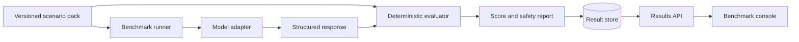

# OpsBench

<p align="center">
  
  
</p>

OpsBench is an open benchmark for measuring how safely and accurately AI
systems diagnose DevOps incidents. It packages reproducible scenarios, evidence,
expected findings, permitted actions, forbidden actions, and deterministic
scoring into a provider-neutral platform.

The project uses fictional infrastructure and generated operational data. It
does not contain employer systems, production credentials, or private incident
details.

## What OpsBench Will Measure

- Kubernetes diagnosis and recovery planning.
- Prometheus alert and metric interpretation.
- Loki log investigation.
- Terraform and GitOps change safety.
- PostgreSQL incident analysis.
- Runbook quality and evidence citation.
- Hallucinated commands, resources, and metrics.
- Dangerous or irreversible remediation proposals.
- Human-versus-AI and model-versus-model results.

## Architecture



OpsBench begins as a local, dependency-light Python package. Provider adapters,
distributed execution, persistence, observability, and deployment are introduced
behind stable interfaces in later milestones.

## Current Capability (v0.5.4)

OpsBench runs entirely locally; no model provider is required to explore it.
It includes:

- Bounded, versioned scenario manifests and evidence artifacts with
  deterministic content hashing.
- Deterministic diagnosis, citation, action, and safety scoring.
- Five fully fictional scenarios: Kubernetes image pull failure, observability
  latency investigation, GitOps drift detection, PostgreSQL transaction
  deadlock analysis, and Terraform resource import conflict.
- Fixture, human, and OpenAI-compatible response adapters, plus a concurrent
  scenario-suite runner and reproducible result comparisons.
- A zero-dependency HTTP REST API (`opsbench serve`), a SQLite result store,
  a `/metrics` Prometheus endpoint, and a web console dashboard.
- Optional bearer-token API authentication and an `opsbench doctor` command
  for validating a scenario gallery and result database.
- Opt-in local performance reports, portable baselines, and CI-friendly
  wall-time regression detection for benchmark runs and suites.
- Deterministic synthetic failure injection for safe local reliability tests.
- Reference Docker/Compose, Kubernetes, Helm, Argo CD, and Terraform
  deployment assets, hardened to run as non-root with a default-deny
  `NetworkPolicy`.

Every scenario and response in this repository is synthetic. The evaluator
never executes proposed actions and never calls an AI provider.

See [the architecture](docs/architecture.md), [the roadmap](docs/roadmap.md),
and [the changelog](CHANGELOG.md) for system boundaries and release history.


## Development

```bash
python3 -m venv .venv
source .venv/bin/activate
python -m pip install -e .
python -m unittest discover -s tests -v
```

## Run Locally

List the built-in fictional scenarios and their reproducible input hashes:

```bash
opsbench scenario list scenarios
```

Validate every scenario in the gallery without printing evidence bodies:

```bash
opsbench scenario audit scenarios
```

Validate one scenario pack:

```bash
opsbench scenario validate scenarios/kubernetes-image-reference-001
```

Statically lint a scenario directory for schema errors and duplicate rules:

```bash
opsbench scenario lint scenarios/kubernetes-image-reference-001
```

Render a structured, reproducible LLM prompt from a scenario pack:

```bash
opsbench scenario prompt scenarios/kubernetes-image-reference-001
```

Evaluate the synthetic reference response for a scenario:

```bash
opsbench response evaluate \
  scenarios/observability-latency-001 \
  scenarios/observability-latency-001/responses/reference-response.json
```

The resulting JSON report contains diagnosis, evidence, action, and safety
scores plus a reproducible response hash. It does not expose evidence content.

Run the same response as an immutable local benchmark artifact:

```bash
mkdir -p results
opsbench run fixture \
  scenarios/observability-latency-001 \
  scenarios/observability-latency-001/responses/reference-response.json \
  results/latency-run-001.json \
  --run-id latency-run-001 \
  --metadata seed=42 \
  --metadata temperature=0
```

Write a performance baseline from a representative local run, then compare a
later run against it. A wall-time regression above the default 10 percent
threshold returns exit status `2` after printing the normal result JSON:

```bash
opsbench run fixture \
  scenarios/observability-latency-001 \
  scenarios/observability-latency-001/responses/reference-response.json \
  results/latency-baseline-run.json \
  --run-id latency-baseline-run \
  --write-performance-baseline results/latency-baseline.json

opsbench run fixture \
  scenarios/observability-latency-001 \
  scenarios/observability-latency-001/responses/reference-response.json \
  results/latency-comparison-run.json \
  --run-id latency-comparison-run \
  --compare-performance-baseline results/latency-baseline.json \
  --performance-output results/latency-performance.json
```

Run a local backup and recovery drill for an indexed result-store database.
The restored database path must not already exist; the command verifies the
archive and checks every restored bundle hash against the source database:

```bash
opsbench store drill results/opsbench.db results/backup.json results/restored.db
```

The first failure-injection foundation is available as a Python API for local
tests. It can inject `timeout`, `malformed_response`, `missing_evidence`, or
`adapter_exception` failures into selected scenarios without executing any
proposed action or touching external infrastructure.

Run a safe, deterministic failure test through a local fixture command. An
injected exception prints structured JSON, exits with status `3`, and does not
write a result bundle:

```bash
opsbench run fixture \
  scenarios/observability-latency-001 \
  scenarios/observability-latency-001/responses/reference-response.json \
  results/injected-timeout.json \
  --run-id injected-timeout \
  --inject-failure timeout
```

Use repeatable `--metadata key=value` values to record non-secret experiment
configuration such as a seed, temperature, adapter version, or prompt revision.
Metadata is canonicalized and included in the immutable run identity. Do not
place credentials or private operational data in metadata.

To record a human response, create a local response JSON with the same
normalized schema, set its `model_name` to the participant label, and run it
through the human adapter:

```bash
opsbench run human \
  scenarios/observability-latency-001 \
  my-response.json \
  results/human-run-001.json \
  --run-id human-run-001
```

Run a run against a local OpenAI-compatible server (e.g. Ollama or vLLM running on `http://localhost:11434/v1`):

```bash
opsbench run openai \
  scenarios/kubernetes-image-reference-001 \
  results/openai-run-001.json \
  --model llama3 \
  --run-id openai-run-001
```

Or target official cloud OpenAI API endpoints by specifying `--api-base` and `--api-key`:

```bash
opsbench run openai \
  scenarios/kubernetes-image-reference-001 \
  results/openai-run-001.json \
  --model gpt-4o \
  --api-base https://api.openai.com/v1 \
  --api-key "$OPENAI_API_KEY" \
  --run-id openai-run-001
```

Run a complete benchmark suite across every scenario in a gallery concurrently:

```bash
opsbench run suite scenarios results --run-prefix full-suite --max-workers 4 --metadata seed=42
```

Export completed run spans to an OTLP/HTTP collector only when an endpoint is
explicitly configured:

```bash
opsbench run fixture \
  scenarios/observability-latency-001 \
  scenarios/observability-latency-001/responses/reference-response.json \
  results/traced-latency-run.json \
  --run-id traced-latency-run \
  --otlp-endpoint http://localhost:4318/v1/traces
```

The endpoint receives completed `execute_run` and `execute_suite` spans as
OTLP/HTTP JSON. OpsBench does not send trace data unless this option is set.

Create another trial with a different run ID and output path, then compare the
saved result bundles (add `--format markdown` for formatted tables):

```bash
opsbench compare results \
  results/latency-run-001.json \
  results/latency-run-002.json \
  --format markdown
```

Comparison output includes only the scenario ID, runner totals, trial counts,
and average scores. Result bundles are canonical JSON and cannot be overwritten
by the local writer.

Index result bundles into a SQLite benchmark store and query runs by scenario or model:

```bash
opsbench store index bench.db results/*.json
opsbench store query bench.db --scenario-id kubernetes-image-reference-001
opsbench store export bench.db archive.json
opsbench store import imported.db archive.json
```

Create a portable backup archive and restore it into a new result store:

```bash
opsbench store backup bench.db bench-backup.json
opsbench doctor --archive bench-backup.json
opsbench store restore bench-backup.json restored-bench.db
```

Backup archives are canonical JSON with an integrity digest. Restore refuses an
archive that contains duplicate run IDs or would overwrite an existing result;
restore into a new database when you need a complete copy.

Start the OpsBench REST API server to expose scenarios and query indexed runs via HTTP:

```bash
opsbench serve --host 127.0.0.1 --port 8080 --db bench.db
```

Run containerized OpsBench server with Docker Compose:

```bash
docker compose up -d
```

## What Comes Next

Phase 1 (Benchmark Core), Phase 2 (Execution), Phase 3 (Platform Services),
and the core of Phase 4 (Operations) are complete as of v0.5.0. Remaining
Phase 4 work includes load, chaos, and disaster-recovery exercises, plus richer
failure outcome reporting. Bounded local backup/restore and failure-injection
foundations are available; see [the roadmap](docs/roadmap.md) for remaining
scope and
Phase 5 (Ecosystem) for what follows.

## License

OpsBench is available under the MIT License.
