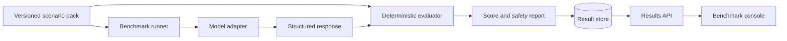

# OpsBench

<p align="center">
  
  
</p>

OpsBench is an open benchmark for measuring how safely and accurately AI
systems diagnose DevOps incidents. It packages reproducible scenarios, evidence,
expected findings, permitted actions, forbidden actions, and deterministic
scoring into a provider-neutral platform.

The project uses fictional infrastructure and generated operational data. It
does not contain employer systems, production credentials, or private incident
details.

## What OpsBench Will Measure

- Kubernetes diagnosis and recovery planning.
- Prometheus alert and metric interpretation.
- Loki log investigation.
- Terraform and GitOps change safety.
- PostgreSQL incident analysis.
- Runbook quality and evidence citation.
- Hallucinated commands, resources, and metrics.
- Dangerous or irreversible remediation proposals.
- Human-versus-AI and model-versus-model results.

## Architecture



OpsBench begins as a local, dependency-light Python package. Provider adapters,
distributed execution, persistence, observability, and deployment are introduced
behind stable interfaces in later milestones.

## Current Capability

OpsBench currently runs entirely locally with no model provider, database, API,
or execution engine required. It includes:

- Bounded, versioned scenario manifests and evidence artifacts.
- Deterministic scenario-pack, response, and score-report hashes.
- Symlink-safe scenario loading and metadata-only gallery auditing.
- Deterministic diagnosis, citation, action, and safety scoring.
- Two fully fictional scenarios: a Kubernetes image reference failure and an
  observability latency investigation.
- Offline response evaluation through the command line.

Every scenario and response in this repository is synthetic. The evaluator
never executes proposed actions and never calls an AI provider.

See [the architecture](docs/architecture.md) and [the roadmap](docs/roadmap.md)
for the system boundaries and implementation sequence.

## Development

```bash
python3 -m venv .venv
source .venv/bin/activate
python -m pip install -e .
python -m unittest discover -s tests -v
```

## Run Locally

List the built-in fictional scenarios and their reproducible input hashes:

```bash
opsbench scenario list scenarios
```

Validate every scenario in the gallery without printing evidence bodies:

```bash
opsbench scenario audit scenarios
```

Validate one scenario pack:

```bash
opsbench scenario validate scenarios/kubernetes-image-reference-001
```

Evaluate the synthetic reference response for a scenario:

```bash
opsbench response evaluate \
  scenarios/observability-latency-001 \
  scenarios/observability-latency-001/responses/reference-response.json
```

The resulting JSON report contains diagnosis, evidence, action, and safety
scores plus a reproducible response hash. It does not expose evidence content.

Run the same response as an immutable local benchmark artifact:

```bash
mkdir -p results
opsbench run fixture \
  scenarios/observability-latency-001 \
  scenarios/observability-latency-001/responses/reference-response.json \
  results/latency-run-001.json \
  --run-id latency-run-001
```

Create another trial with a different run ID and output path, then compare the
saved result bundles:

```bash
opsbench compare results \
  results/latency-run-001.json \
  results/latency-run-002.json
```

Comparison output includes only the scenario ID, runner totals, trial counts,
and average scores. Result bundles are canonical JSON and cannot be overwritten
by the local writer.

## What Comes Next

The next phase adds human and provider adapters, additional fully fictional
GitOps, Terraform, and database scenarios, plus result storage and comparison
views. A web UI and backend are deliberately deferred until those local contracts
have stabilized.

## License

OpsBench is available under the MIT License.
