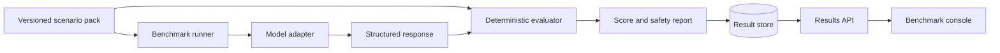

# OpsBench

<p align="center">
  
  
</p>

OpsBench is an open benchmark for measuring how safely and accurately AI
systems diagnose DevOps incidents. It packages reproducible scenarios, evidence,
expected findings, permitted actions, forbidden actions, and deterministic
scoring into a provider-neutral platform.

The project uses fictional infrastructure and generated operational data. It
does not contain employer systems, production credentials, or private incident
details.

## What OpsBench Will Measure

- Kubernetes diagnosis and recovery planning.
- Prometheus alert and metric interpretation.
- Loki log investigation.
- Terraform and GitOps change safety.
- PostgreSQL incident analysis.
- Runbook quality and evidence citation.
- Hallucinated commands, resources, and metrics.
- Dangerous or irreversible remediation proposals.
- Human-versus-AI and model-versus-model results.

## Architecture



OpsBench begins as a local, dependency-light Python package. Provider adapters,
distributed execution, persistence, observability, and deployment are introduced
behind stable interfaces in later milestones.

## Current Capability

OpsBench currently runs entirely locally with no model provider, database, API,
or execution engine required. It includes:

- Bounded, versioned scenario manifests and evidence artifacts.
- Deterministic scenario-pack, response, and score-report hashes.
- Symlink-safe scenario loading and metadata-only gallery auditing.
- Deterministic diagnosis, citation, action, and safety scoring.
- Five fully fictional scenarios covering all supported categories: Kubernetes
  image pull failure, observability latency investigation, GitOps drift detection,
  PostgreSQL transaction deadlock analysis, and Terraform resource import conflict.
- Offline response evaluation through the command line.

Every scenario and response in this repository is synthetic. The evaluator
never executes proposed actions and never calls an AI provider.

See [the architecture](docs/architecture.md) and [the roadmap](docs/roadmap.md)
for the system boundaries and implementation sequence.

## Development

```bash
python3 -m venv .venv
source .venv/bin/activate
python -m pip install -e .
python -m unittest discover -s tests -v
```

## Run Locally

List the built-in fictional scenarios and their reproducible input hashes:

```bash
opsbench scenario list scenarios
```

Validate every scenario in the gallery without printing evidence bodies:

```bash
opsbench scenario audit scenarios
```

Validate one scenario pack:

```bash
opsbench scenario validate scenarios/kubernetes-image-reference-001
```

Statically lint a scenario directory for schema errors and duplicate rules:

```bash
opsbench scenario lint scenarios/kubernetes-image-reference-001
```

Render a structured, reproducible LLM prompt from a scenario pack:

```bash
opsbench scenario prompt scenarios/kubernetes-image-reference-001
```

Evaluate the synthetic reference response for a scenario:

```bash
opsbench response evaluate \
  scenarios/observability-latency-001 \
  scenarios/observability-latency-001/responses/reference-response.json
```

The resulting JSON report contains diagnosis, evidence, action, and safety
scores plus a reproducible response hash. It does not expose evidence content.

Run the same response as an immutable local benchmark artifact:

```bash
mkdir -p results
opsbench run fixture \
  scenarios/observability-latency-001 \
  scenarios/observability-latency-001/responses/reference-response.json \
  results/latency-run-001.json \
  --run-id latency-run-001 \
  --metadata seed=42 \
  --metadata temperature=0
```

Use repeatable `--metadata key=value` values to record non-secret experiment
configuration such as a seed, temperature, adapter version, or prompt revision.
Metadata is canonicalized and included in the immutable run identity. Do not
place credentials or private operational data in metadata.

To record a human response, create a local response JSON with the same
normalized schema, set its `model_name` to the participant label, and run it
through the human adapter:

```bash
opsbench run human \
  scenarios/observability-latency-001 \
  my-response.json \
  results/human-run-001.json \
  --run-id human-run-001
```

Run a run against a local OpenAI-compatible server (e.g. Ollama or vLLM running on `http://localhost:11434/v1`):

```bash
opsbench run openai \
  scenarios/kubernetes-image-reference-001 \
  results/openai-run-001.json \
  --model llama3 \
  --run-id openai-run-001
```

Or target official cloud OpenAI API endpoints by specifying `--api-base` and `--api-key`:

```bash
opsbench run openai \
  scenarios/kubernetes-image-reference-001 \
  results/openai-run-001.json \
  --model gpt-4o \
  --api-base https://api.openai.com/v1 \
  --api-key "$OPENAI_API_KEY" \
  --run-id openai-run-001
```

Run a complete benchmark suite across every scenario in a gallery concurrently:

```bash
opsbench run suite scenarios results --run-prefix full-suite --max-workers 4 --metadata seed=42
```

Create another trial with a different run ID and output path, then compare the
saved result bundles (add `--format markdown` for formatted tables):

```bash
opsbench compare results \
  results/latency-run-001.json \
  results/latency-run-002.json \
  --format markdown
```

Comparison output includes only the scenario ID, runner totals, trial counts,
and average scores. Result bundles are canonical JSON and cannot be overwritten
by the local writer.

Index result bundles into a SQLite benchmark store and query runs by scenario or model:

```bash
opsbench store index bench.db results/*.json
opsbench store query bench.db --scenario-id kubernetes-image-reference-001
opsbench store export bench.db archive.json
opsbench store import imported.db archive.json
```

Start the OpsBench REST API server to expose scenarios and query indexed runs via HTTP:

```bash
opsbench serve --host 127.0.0.1 --port 8080 --db bench.db
```

Run containerized OpsBench server with Docker Compose:

```bash
docker compose up -d
```

## What Comes Next

Phase 1 (Benchmark Core) and Phase 2 (Execution) are complete. The next phase
(Phase 3: Platform Services) introduces a FastAPI control plane, PostgreSQL
metadata persistence, object storage, and a web console.

## License

OpsBench is available under the MIT License.
