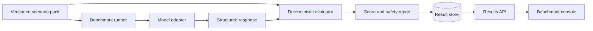

# OpsBench

OpsBench is an open benchmark for measuring how safely and accurately AI
systems diagnose DevOps incidents. It packages reproducible scenarios, evidence,
expected findings, permitted actions, forbidden actions, and deterministic
scoring into a provider-neutral platform.

The project uses fictional infrastructure and generated operational data. It
does not contain employer systems, production credentials, or private incident
details.

## What OpsBench Will Measure

- Kubernetes diagnosis and recovery planning.
- Prometheus alert and metric interpretation.
- Loki log investigation.
- Terraform and GitOps change safety.
- PostgreSQL incident analysis.
- Runbook quality and evidence citation.
- Hallucinated commands, resources, and metrics.
- Dangerous or irreversible remediation proposals.
- Human-versus-AI and model-versus-model results.

## Architecture



OpsBench begins as a local, dependency-light Python package. Provider adapters,
distributed execution, persistence, observability, and deployment are introduced
behind stable interfaces in later milestones.

## Repository Status

The repository foundation is complete. The next milestone defines and validates
the versioned scenario contract before adding model integrations.

See [the architecture](docs/architecture.md) and [the roadmap](docs/roadmap.md)
for the system boundaries and implementation sequence.

## Development

```bash
python3 -m venv .venv
source .venv/bin/activate
python -m pip install -e .
python -m unittest discover -s tests -v
```

## License

OpsBench is available under the MIT License.