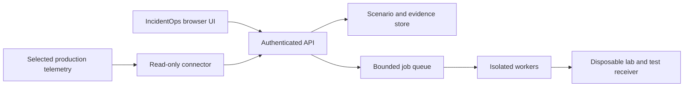

# Architecture

The current implementation is a local benchmark engine and prototype console.
IncidentOps is the adopted [product direction](product-direction.md), not an
already deployed platform. This document separates those boundaries explicitly.

## Design Goals

OpsBench is designed around five constraints:

1. **Reproducibility:** The same scenario, response, and evaluator version must
   produce the same score.
2. **Provider neutrality:** Scenario packs and scoring cannot depend on one AI
   vendor or model API.
3. **Safety:** Proposed actions are evaluated separately from diagnostic
   accuracy, with explicit penalties for destructive or unsupported actions.
4. **Extensibility:** Preserve local benchmark contracts while designing
   separately versioned verification and simulation results.
5. **Auditability:** Every score traces back to scenario evidence, evaluator
   rules, and the exact submitted response.

## Bounded Components

| Component | Current responsibility | Planned extension |
| --- | --- | --- |
| Scenario SDK | Validate and version fictional packs. | Verification assertions and model-versioned rehearsal definitions. |
| Runner | Execute local benchmark runs and suites through adapters. | Separate verification and simulation execution backends. |
| Adapter SDK | Normalize fixture, human, and provider responses. | No automatic conversion into production connectors. |
| Evaluator | Deterministic keyword, artifact-ID, action, and safety checks. | Stage-level assertions; no semantic or remediation-safety certification. |
| Result store | Immutable bundles and a SQLite index. | Evidence retention and compatible versioned result types. |
| API | Expose health, scenarios, indexed results, and capabilities. | Authenticated job submission and bounded evidence access. |
| Console | Interactive 2.5D benchmark model, scenario search, run reports/comparison, portfolio views. | Observe, Verify, Rehearse, live evidence and incident timelines. |
| Connector | Not implemented as a production collection service. | Allowlisted, read-only, redacted observations. |
| Worker service | No queue-driven worker service. | Isolated jobs with deadlines, cancellation, quotas, and cleanup. |

## Core Data Flow

1. A scenario pack declares evidence and expected findings.
2. The runner snapshots the scenario and evaluator versions into a benchmark job.
3. An adapter submits scenario evidence to a human or model.
4. The adapter returns a provider-neutral structured response.
5. The evaluator produces a deterministic score breakdown and safety findings.
6. The immutable result is stored with hashes for later reproduction.

## Planned IncidentOps Flow

All new services in this diagram are targets, not current runtime guarantees.
An outbound connector can operate within a private network. Browser clients
never receive infrastructure credentials. Production collection identities and
lab execution identities are separate, with no credential inheritance.

### Result Semantics

- Preserve scenario ID, version, input hashes, and evidence provenance.
- Identify execution mode explicitly: benchmark, verification, or simulation.
- Verification records the expected path, configuration versions, observation
   timestamps, per-stage assertion outcomes, and untested boundaries.
- Model passed, failed, unknown, and not-tested stages separately. Record run
   failure/cancellation separately from the system behaviour being tested.
- A direct Alertmanager injection cannot establish collection or rule health.
   Receiver acceptance is not proof of downstream delivery or human response.
- Simulation records model version, checkpoint lineage, decisions, and matched
   workload/fault schedules. Do not mix blind and informed attempts in rankings.
- Real infrastructure observations are time-bounded evidence, not deterministic
   snapshots or proof of counterfactual production outcomes.

These are contract requirements, not new API fields implemented by this update.
Choose schema migrations and compatibility tests before extending persistence.

## Deployment and Scaling Path

1. Local development: existing Python CLI/API and Vite console; disposable lab
    integration is the next execution target.
2. Self-hosted team pilot: HTTPS, OIDC, authorized evidence access, isolated
    workers, retention, and verified backup/restore. A VM is sufficient initially;
    Kubernetes is optional, not a requirement for product usefulness.
3. Hosted service: only after tenant isolation, quotas, audit, secret management,
    and recovery gates pass. Queue, PostgreSQL, and object-storage choices remain
    implementation decisions rather than current dependencies.

Jobs must have deadlines, idempotency keys, bounded retries, and cleanup even
after cancellation or worker failure. Retry policy must not duplicate external
notifications. Observe-only access cannot authorize canary writes or lab jobs.

## Security Boundary

Treat scenario packs and imported evidence as untrusted. Existing validation
does not sandbox arbitrary future test execution. Planned workers need isolated
filesystems, restricted egress, resource limits, and lab-scoped identities.
Provider secrets stay outside packs; private evidence must not go to an external
model without explicit data-owner approval.

Reference manifests declare non-root/read-only settings and network policies;
actual enforcement depends on runtime configuration and cluster networking.
The current stdlib server and optional bearer token are not a multi-user
security boundary. The console also lacks browser token handling. See
[SECURITY.md](../SECURITY.md) and the [roadmap](roadmap.md) for readiness gates.
